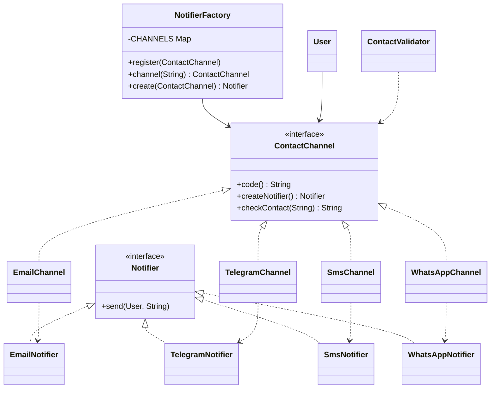

# MD1 Group A - Refactoring a growing switch

Course: Designing Applications Using Design Patterns
Team: Forogh Anoosh, Farhad

## Our task

We got the BookLoversClub project. In this project there is a switch that grows every time
we add a new contact channel. Our task was to change it to Strategy / Factory, so every
channel is a separate class with one common interface. We also had to show that we can add
a new channel without changing the old code.

## Files

- `before/Main.java` - the original code from the teacher (with the switch)
- `after/Main.java` - our code after refactoring, with a WhatsApp demo

## What was the problem

In the old code `NotifierFactory` looked like this:

```java
switch (channel) {
    case TELEGRAM: return new TelegramNotifier();
    case SMS:      return new SmsNotifier();
    case EMAIL:
    default:       return new EmailNotifier();
}
```

`ContactChannel` was an enum, and `ContactValidator` also had a check only for email:

```java
if (u.getChannel() == ContactChannel.EMAIL && !c.contains("@"))
```

So if we want to add WhatsApp, we need to change 3 places: the enum, the switch and the
validator. This is against the Open/Closed principle, because we must open and edit old
code every time.

## What we changed

1. `ContactChannel` is now an interface, not an enum. It has 3 methods:
   `code()`, `createNotifier()` and `checkContact()`.
2. Every channel has its own class: `EmailChannel`, `TelegramChannel`, `SmsChannel`.
   This is the Strategy pattern.
3. Every channel creates its own notifier in `createNotifier()`. This is the Factory Method.
4. `NotifierFactory` has no switch now. It keeps all channels in a Map and finds them by
   name. New channels can be added with `register()`.
5. `ContactValidator` does not check for email anymore. It just calls
   `u.getChannel().checkContact(c)` and every channel checks its own contact.
6. We added `addContactChannel()` to the `BookLoversClub` facade.

The other parts of the project (registration, matching, profiles, meetups) work the same
as before.

## Adding a new channel (demo)

To show that it works, we added WhatsApp. We did not change any old class. We only wrote
2 new classes at the end of `after/Main.java`:

- `WhatsAppNotifier`
- `WhatsAppChannel`

and one line in `main()`:

```java
club.addContactChannel(new WhatsAppChannel());
```

In part 7 of the demo you can see that:
- before we register it, WHATSAPP is unknown
- after we register it, a user with WhatsApp can join
- a user with a wrong number is not accepted (WhatsApp checks its own number format)
- the meetup message also goes to the new user by WhatsApp

If you want to add another channel, for example Viber, you only need to write
`ViberNotifier`, `ViberChannel` and call `addContactChannel`.

## Class diagram



## Patterns in the project

| # | Pattern | Where |
|---|---------|-------|
| 1 | Singleton | UserRepository |
| 2 | Builder | User.Builder |
| 3 | Factory Method | ContactChannel.createNotifier(), NotifierFactory (changed by us) |
| 4 | Adapter | LegacyCatalogAdapter |
| 5 | Decorator | ProfileView and decorators |
| 6 | Facade | BookLoversClub |
| 7 | Strategy | MatchStrategy, and now also ContactChannel (added by us) |
| 8 | Observer | ClubEventBus, UserSubscriber |
| 9 | Chain of Responsibility | RegistrationValidator |

## How to run

You need Java 11 or newer.

```
cd after
javac Main.java
java Main
```

or without javac:

```
java after/Main.java
```

The old version runs the same way from the `before` folder.

On Windows, if emoji look strange in the console, run `chcp 65001` first.
